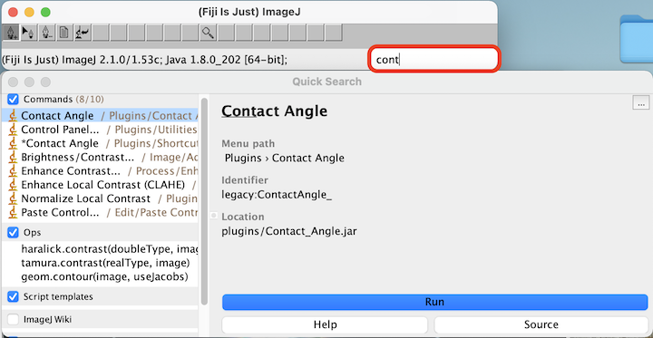
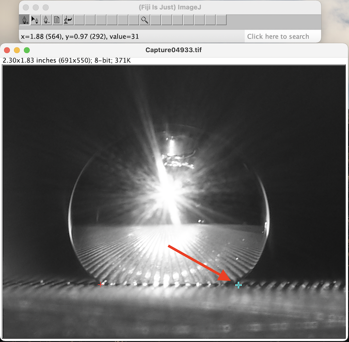

# Contact Angle Analysis
Take raw image files of a drop on a surface and analyze the contact angles
### Quick Start (MacOS)
1. Clone this repository into a new folder where you will keep other related files.
2. Open the QuickStart folder in this repository.
3. Right-click on FIJI and select open. There will be a pop-up about an unverified developer, just open anyway.
4. You are now ready to begin the procedure below.

### Procedure (MacOS)
#### 1. Prepare Images
1. Open the folder with drop images in Finder.
2. Select all (⌘A).
3. Open with Preview (⌘O).
4. Use mouse to select only the area containing the drop.

5. Crop the image (⌘K).
6. Go to next image (down arrow key).
7. Repeat steps 4 and 5 for each image.
8. Make a copy of the entire folder of images and save it next to the first folder. One of these folders will eventually house the images with an ellipse fit overlayed, and the other will contain the original cropped images.
#### 2. ImageJ
1. Open FIJI.
2. Drag the first cropped image file from finder into the lower bar in FIJI.

3. Start typing "Contact Angle" into the FIJI search bar.

4. Hit enter to open the Contact Angle plugin
5. On the image, click the first point where the drop meets the stage. This should place a small colored cross at the location that you clicked.

6. Place another cross at the other location where the drop meets the stage.

7. Starting from where the last cross was placed, place about 10 more crosses along the edge of the drop concentrating them mostly in the areas just above where the drop contacts the stage.

8. Click the button with the page icon in the ImageJ toolbar.

9. Select "Manual Points Procedure". Notice that this will create a Results.csv file.

10. Open the next image in FIJI(⌘⇧O).
11. A window will pop up asking you to save the image. Hit enter to save on the first time through the images.

12. Repeat steps 3 through 10 until this has been done once for each image.
13. Now do this 2 more times for each image. Notice a few slight changes. For step 2, go to the copied folder that has undoctored images to drag in the first image. In step 11, don't save the new images this time. In the end, you will use the plugin three times on each image. This means repeating steps 2 through 10 two more times with the slight changes.
12. Click on the results file and save as "Results.csv" in the same directory as the contact-angle-analysis folder.

#### 3. Analysis
1. Make a new csv file called Overview.csv with the following information: Drop Number,Time,Location,Material,Drop Material,Image Number Start,Interpolated Temperature,Tip Temperature,Pressure. Here is an example of the [Overview.csv](examples/Overview.csv) file.
2. Open a terminal and navigate to the Contact Angle Analysis directory.
3. Run the post_processing.py file by typing the following into the command line:
```
python3 post_processing.py
```
4. Two csv files are created as output. [Output_byDrop.csv](examples/Output_byDrop.csv) organizes the data by drop and [Output_byImage.csv](examples/Output_byImage.csv) organizes the data by image (click on the file names to see examples).
