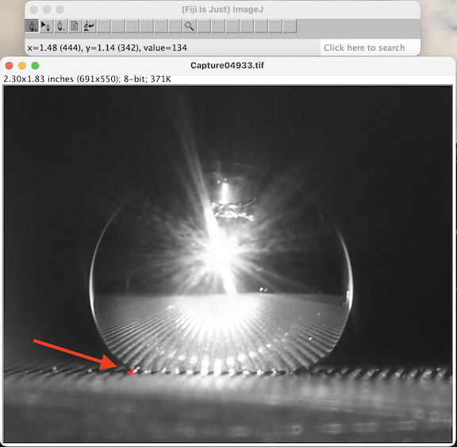

# Contact Angle Analysis
Take raw image files of a drop on a flat surface and analyze the contact angles with an ellipse and circle best fit.
### Quick Start
#### MacOS
1. Clone this repository into a new folder where you will keep other related files.
2. Download FIJI for MacOS from this [link](https://imagej.net/software/fiji/downloads).
3. Download the Contact_Angle.jar file from this [link](https://imagej.nih.gov/ij/plugins/contact-angle.html).
4. Drag the Contact_Angle.jar file into the plugins folder of FIJI that you just downloaded.
5. Right-click on FIJI and select open. There will be a pop-up about an unverified developer, just open anyway.
6. FIJI will ask you to update the first time you open it and only periodically after that. Just click update and restart FIJI.
7. You are now ready to begin the procedure below.
#### Linux
1. Clone this repository into a new folder where you will keep other related files.
2. Download FIJI for MacOS from this [link](https://imagej.net/software/fiji/downloads).
3. Download the Contact_Angle.jar file from this [link](https://imagej.nih.gov/ij/plugins/contact-angle.html).
4. Drag the Contact_Angle.jar file into the plugins folder of FIJI that you just downloaded.
5. Open FIJI by executing the program.
6. FIJI will ask you to update the first time you open it and only periodically after that. Just click update and restart FIJI.
7. You are now ready to begin the procedure below.

## Procedure
### MacOS
#### 1. Prepare Images
1. Open the folder with drop images in Finder.
2. Select all (⌘A).
3. Open with Preview (⌘O).
4. Use mouse to select only the area containing the drop.

5. Crop the image (⌘K).
6. Go to next image (down arrow key).
7. Repeat steps 4 and 5 for each image.
8. Make a copy of the entire folder of images and save it next to the first folder. One of these folders will eventually house the images with an ellipse fit overlayed, and the other will contain the original cropped images.
#### 2. ImageJ
1. Open FIJI.
2. Drag the first cropped image file from finder into the lower bar in FIJI.\

3. Start typing "Contact Angle" into the FIJI search bar.\

4. Hit enter to open the Contact Angle plugin
5. On the image, click the first point where the drop meets the stage. This should place a small colored cross at the location that you clicked.\

6. Place another cross at the other location where the drop meets the stage.\

7. Starting from where the last cross was placed, place about 10 more crosses along the edge of the drop concentrating them mostly in the areas just above where the drop contacts the stage.\

8. Click the button with the page icon in the ImageJ toolbar.\

9. Select "Manual Points Procedure". Notice that this will create a Results.csv file.\

10. Open the next image in FIJI(⌘⇧O).
11. A window will pop up asking you to save the image. Hit enter to save on the first time through the images.\

12. Exit the contact angle plugin by clicking this button in the FIJI toolbar.\

13. Repeat steps 3 through 12 until this has been done once for each image.
14. Now do this 2 more times for each image. Notice a few slight changes. For step 2, go to the copied folder that has undoctored images to drag in the first image. In step 11, don't save the new images this time. In the end, you will use the plugin three times on each image. This means repeating steps 2 through 10 two more times with the slight changes.
15. Click on the results window (pictured below) and save as "Results.csv" in a new folder.

#### 3. Analysis
1. Open a terminal and navigate to the contact-angle-analysis directory on your computer using cd commands.
2. Run pre_processing.py from the terminal by typing the following into the command line:
```
python3 pre_processing.py
```
3. When prompted, select the directory with the data-X.pkl files (where X is a number).
4. This will create a file called Overview.xlsx. Move Overview.xlsx to the same folder that Results.csv was saved in.
5. Run post_processing.py from the terminal by typing:
```
python3 post_processing.py
```
6. Select the folder you created earlier (now containing the Overview.xlsx and Results.csv files).
5. Two csv files are created as output. [output_byDrop.csv](examples/output_byDrop.csv) organizes the data by drop and [output_byImage.csv](examples/output_byImage.csv) organizes the data by image (click on the file names to see examples).
### Linux
#### 1. Prepare Images
1. Find the folder with drop images in the file manager application.
2. Select all of the photos.
3. Open with Gwenview.
4. Use the cropping tool (Shift+X).
5. Select the region around the drop and press enter.
6. Go to next image (down arrow key).
7. Repeat steps 4 and 5 for each image.
8. Make 3 copies of the entire folder of images and save them next to the first folder. Three of these folders will eventually house the images with an ellipse fit overlaid, and the final one will contain just the original cropped images.
#### 2. ImageJ
1. Open FIJI.
2. Drag the first cropped image file from the file manager into the lower bar in FIJI.\

3. Start typing "Contact Angle" into the FIJI search bar.\

4. Hit enter to open the Contact Angle plugin
5. On the image, click the first point where the drop meets the stage. This should place a small colored cross at the location that you clicked.\

6. Place another cross at the other location where the drop meets the stage.\

7. Starting from where the last cross was placed, place about 10 more crosses along the edge of the drop concentrating them mostly in the areas just above where the drop contacts the stage.\

8. Click the button with the page icon in the ImageJ toolbar.\

9. Select "Manual Points Procedure". Notice that this will create a Results.csv file.\

10. Open the next image in FIJI(⌘⇧O).
11. A window will pop up asking you to save the image. Hit enter to save on the first time through the images.\

12. Exit the contact angle plugin by clicking this button in the FIJI toolbar.\

13. Repeat steps 3 through 12 until this has been done once for each image.
14. Now do this 2 more times for each image. Notice a few slight changes. For step 2, go to the copied folder that has undoctored images to drag in the first image. In step 11, don't save the new images this time. In the end, you will use the plugin three times on each image. This means repeating steps 2 through 10 two more times with the slight changes.
15. Click on the results window (pictured below) and save as "Results.csv" in a new folder.

#### 3. Analysis
1. Open the command line and navigate to the contact-angle-analysis directory on your computer using cd commands.
2. Run pre_processing.py from the terminal by typing the following into the command line:
```
python3 pre_processing.py
```
3. When prompted, select the directory with the data-X.pkl files (where X is a number).
4. This will create a file called Overview.xlsx. Move Overview.xlsx to the same folder that Results.csv was saved in.
5. Run post_processing.py from the terminal by typing:
```
python3 post_processing.py
```
6. Select the folder you created earlier (now containing the Overview.xlsx and Results.csv files) when prompted.
5. Two csv files are created as output. [output_byDrop.csv](examples/output_byDrop.csv) organizes the data by drop and [output_byImage.csv](examples/output_byImage.csv) organizes the data by image (click on the file names to see examples).
